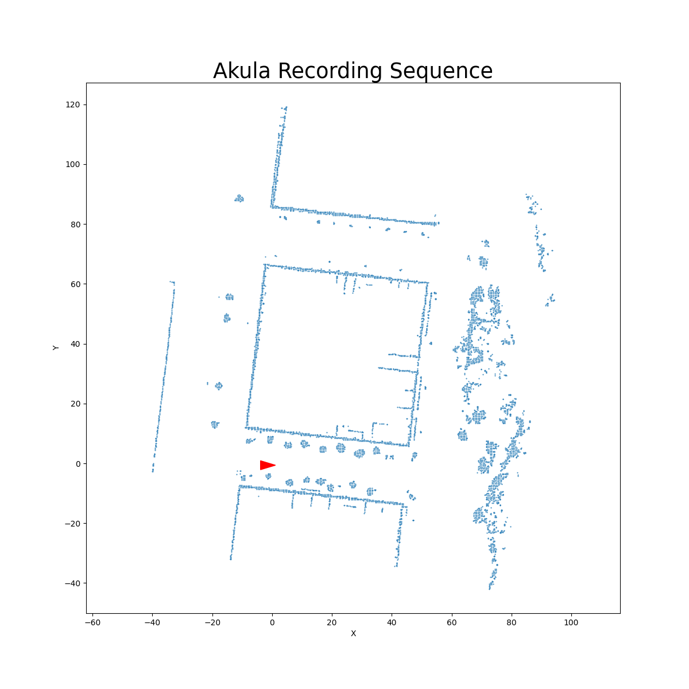

# A-LOAM-Docker
This repo contains Docker image for [A-LOAM](https://github.com/HKUST-Aerial-Robotics/A-LOAM) and useful information for working with it.

## Building and launching Docker image
At first you need to build Docker image.
```
cd <path-to-this-repo>
docker build -t a-loam:latest .
```
Then you can run Docker image with our script:
```
xhost +
./run.sh <path-to-A-LOAM-repo>
```
You can get A-LOAM [here](https://github.com/HKUST-Aerial-Robotics/A-LOAM).

## Using Docker image
### Dataset playing
For playing Velodyne VLP-16 dataset you need to connect to the existing Docker container from the second terminal instance:
```
docker exec -it <container-id> bash
```
Then you can play Rosbag:
```
rosbag play <path-to-dataset>
```
### Rosbag recording
You can record Rosbag for saving dataset playing results from the third terminal instance:
```
rosbag record /aft_mapped_to_init /laser_cloud_map /velodyne_cloud_registered
```
*NOTE:* You can record any other topics, but we will use only these ones.
### Getting point clouds
**Use the provided [notebook](bag2pcd.ipynb)**

### Getting trajectory
Per frame trjaectory is available in `/aft_mapped_to_init` topic.

# Coverting from ros2 to ros1:
### Using rosbags python lib
to install it: 
```bash
pip install rosbags
```
and then use 
```bash
rosbags-convert <dir-to-ros2-bag> --include-topic <topic_one --include-topic <topic_two> 
#example 
rosbags-convert data_folder --include-topic /velodyne_points --include-topic /imu
```
#### This only works for [supported messages](https://ternaris.gitlab.io/rosbags/topics/typesys.html#included-message-types)
in our case pointclods and IMUs are supoorted

### Addtional Method:  
**[The notebook](bag2pcd.ipynb)** is now updated with method to save selected topics from a ROS2 bag. 
you can use is to save sub ros2bag and then use rosbags python lib 
```bash 
rosbags-convert <dir-to-ros2-bag>
# Example
rosbags-convert data_folder 
``` 
<<<<<<< HEAD
=======
3. In shell **B**: 
```shell
# Source ROS 1:
source /opt/ros/noetic/setup.bash
# Run ros core
roscore
```
4. In shell **C**: 
```shell
# Source ROS 1:
source /opt/ros/noetic/setup.bash
# navigat to the directory you want the bag to be stored in
cd <path>
# record all topics with 
rosbag record -a 
# or record a certain topic or topics with 
rosbag record <topic1_name> <topic2_name> <topic3_name>
```
5. In shell **D**: 
```shell
# Source ROS 2:
source /opt/ros/foxy/setup.bash
# Run the ros2 bag .db3
ros2 bag play <name_of_the_ros2_bag.db3>
```
6. when the bag is finished playing stop the recording the the ros1 bag .bag should be in the dirctory you record in. 


# Plot map in 2D with LOAM odometry
given the map and bag file processed and saved before, run the command below to filter map ground points and outliers. we will store:
>>>>>>> 110e0d18c4276c60910b8453e147d886403ad358

- rectification matrix in SE3
- process map 
- project LOAM to 2D
- save plots for PC map projection by LOAM sequences
```
python project_map.py --map_path /path-to-map.pcd --bag_path path-to-bag.bag --save_path path-to-save-materials
```


# Plot map in 2D with Localization odometry



given the map and odom file from localization, run the command below to plot solution and map in 2D. we will store:

- rectification matrix in SE3
- process map 
- project localization to 2D
- save plots for PC map projection by localization sequences
```
python bag2_2Dmap.py --map_path /path-to-map.pcd --poses path-to-odom.csv --save_path path-to-save-materials
```
